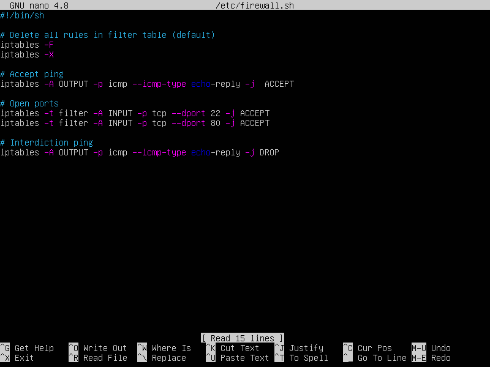
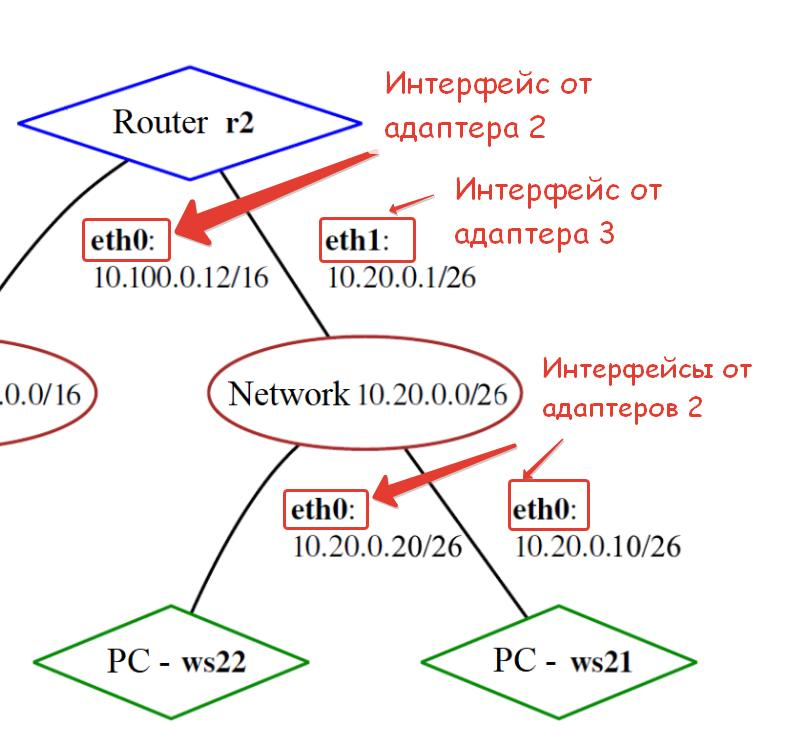
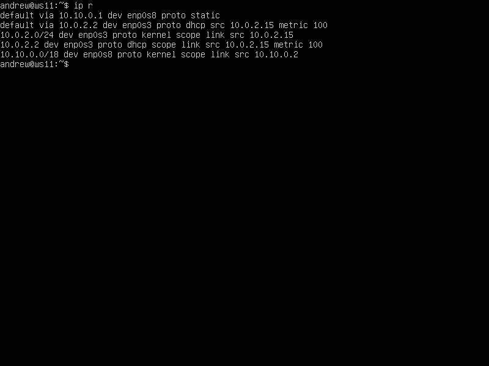

# Linux 02

## Part 1. Инструмент **ipcal**

---

### 1.1. Сети и маски

---

1) Адрес сети *192.167.38.54/13*


2)Перевод маски *255.255.255.0* в префиксную и двоичную запись, */15* в обычную и двоичную, *11111111.11111111.11111111.11110000* в обычную и префиксную


3) Минимальный и максимальный хост в сети *12.167.38.4* при масках: */8*, *11111111.11111111.00000000.00000000*, *255.255.254.0* и */4*

### 1.2 localhost

---

можно ли обратиться к приложению, работающему на localhost, со следующими IP:

1. *194.34.23.100 - нет*
2. *127.0.0.2 - да (имеется loopback)*
3. *127.1.0.1 - да (имеется loopback)*
4. *128.0.0.1 - нет*


### 1.3 Диапазоны и сегменты сетей

---


1) Какие IP можно использовать в качестве публичного, а какие только в качестве частных

1. *10.0.0.45 - частные*
2. *134.43.0.2 - публичный*
3. *192.168.4.2 - частные*
4. *172.20.250.4 - частный*
5. *172.0.2.1 - публичный*
6. *192.172.0.1 - публичный*
7. *172.68.0.2 - публичный*
8. *172.16.255.255 - частный*
9. *10.10.10.10 - частные*
10. *192.169.168.1 - публичные*

2) Какие из IP адресов шлюза возможны у сети *10.10.0.0/18*:

1. *10.0.0.1 - невозможен*
2. *10.10.0.2 - возможен*
3. *10.10.10.10 - возможен*
4. *10.10.100.1 - невозможен*
5. *10.10.1.255 - возможен*

## Part 2. Статическая маршрутизация между двумя машинами

---

Подними две виртуальные машины (далее -- ws1 и ws2).


С помощью команды ip a посмотри существующие сетевые интерфейсы.


- Опиши сетевой интерфейс, соответствующий внутренней сети, на обеих машинах и задать следующие адреса и маски: ws1 - *192.168.100.10*, маска */16*, ws2 - *172.24.116.8*, маска */12*.


С помощью команды `ip a` посмотри существующие сетевые интерфейсы.


### 2.1. Добавление статического маршрута вручную

---

**Добавляем статический маршрут от одной машины до другой командой**

---

**Команда ip r add используется для добавления пользовательских маршрутов в таблицу маршрутизации, позволяет вручную настроить, каким образом пакеты будут направляться к определенным сетям или хостам, после перезагрузки системы настройки удаляются.**

**Для sw1 введем команду**
**sudo ip r add 172.24.116.8 via 192.168.100.10 dev enp0s8**
**добавив статический маршрут до ws2**


- - -

**Для sw2 введем команду**
**sudo ip r add 192.168.100.10 via 172.24.116.8 dev enp0s8**
**добавив статический маршрут до ws1**


---

**Пропингуем соединение с помощью ping -c 5 на обеих машинах**


---

**Перезапустим машины sudo reboot**
### 2.2. Добавление статического маршрута с сохранением
**Добавляем статический маршрут с сохранением от одной машины до другой с помощью файла *etc/netplan/00-installer-config.yaml***


**После внесения изменений вызвана команда sudo netplan apply и пропинговано соединение между машинами.**

**Пропингуем соединение между машинами**


## Part 3. Утилита **iperf3**

---

### 3.1. Скорость соединения

Переведи и запиши в отчёт: 8 Mbps в MB/s, 100 MB/s в Kbps, 1 Gbps в Mbps.

Чтобы перевести скорость из мегабитов в секунду (Mbps) в мегабайты в секунду (MB/s), нужно разделить значение в мегабитах на 8, так как в 1 байте содержится 8 битов.

- 8 Mbps == 1MB/s (/8)
- 100 MB/s == 800 000Kbps 
переводим мегабайты в мегабиты → 100MB/s * 8 == 800Mbps 
переводим мегабиты в килобиты → 800Mbps * 1 000 = 800 000Kbps
- 1 Gbps == 1 000Mbps (*1000)

### 3.2. Утилита **iperf3**

Измерь скорость соединения между sw1 и sw2.

**Устанавливаем утилиту iperf3**
sudo apt install iperf3


ws1 выступает в роли сервера iperf3 -s


ws2 выступает в роли клиента iperf3 -c 192.168.100.10
Далее происходил обмен трафиком, и выведена средняя скорость передачи данных - 2.19Gbps


## Part 4. Сетевой экран

---

### 4.1. Утилита **iptables**

(Ссылки на материалы по iptables [тут](https://www.opennet.ru/man.shtml?topic=iptables&category=8&russian=0) и [тут](https://losst.pro/nastrojka-iptables-dlya-chajnikov))

**Создаем файл /etc/firewall.sh, имитирующий фаерволл, на sw1 и sw2**


- на sw1 написать сначала запрещающее, а потом разрешающее правило на пинг
    
Запрещающее правило:
    
    `iptables -A OUTPUT -p icmp --icmp-type echo-reply -j DROP`
    
Разрешающее правило:
    
    `iptables -A OUTPUT -p icmp --icmp-type echo-reply -j ACCEPT`
- Проверка, что правила добавлены (sudo iptables -L --line-numbers)

- Запустим ping c sw2, увидим, что sw1 перестала пинговаться

- Запустим ping c sw1 на sw2, увидим что пингуется

- обратную последовательность команд добавим для sw2 (в начале пишется разрешающее правило, а в конце пишется запрещающее правило)

    
    Разрешающее правило:
    
    `iptables -A OUTPUT -p icmp --icmp-type echo-reply -j ACCEPT`
    
    Запрещающее правило:
    
    `iptables -A OUTPUT -p icmp --icmp-type echo-reply -j DROP`


- откроем на машинах доступ для порта 22 (ssh) и порта 80 (http)
`iptables -t filter -A INPUT -p tcp --dport 22 -j ACCEPT`
    
    `iptables -t filter -A INPUT -p tcp --dport 80 -j ACCEPT`
Файлы /etc/firewall.sh


Запусти файлы на обеих машинах командами `chmod +x /etc/firewall.sh` и `/etc/firewall.sh`.
- sw1


- sw2




### 4.2. Утилита **nmap**

Устанавливаем утилиту `sudo apt install nmap` .
Пингуем sw2 - sw1, видим, что отклика нет, после вызываем `nmap 192.168.100.10` и видим, что хост машины запущен.

sw-2


Host is up

- **Сохранение дампов образов виртуальных машин**
    
    Дамп - состояние машины.
    
    Сохраняем текущее состояние в интерфейсе VirtualBox.


сохранение дампов образов виртуальных машин
## Part 5. Статическая маршрутизация сети

---

### 5.1. Настройка адресов машин

Настрой конфигурации машин в *etc/netplan/00-installer-config.yaml* согласно сети на рисунке.

Поднял пять виртуальных машин: 3 рабочие станции (ws11, ws21, ws22) и 2 роутера (r1, r2)

Подключал несколько адаптеров  (два - для рабочих станций, и три - для роутеров) при поднятии машин. У всех машин в первом адаптере выбран NAT (ему соответствует интерфейс enp0s3).

ВАЖНО! От каждого включенного адаптера создается один сетевой интерфейс. Они создаются по порядку: enp0s3 (от адаптера 1),  enp0s8 (от адаптера 2) и enp0s9 (от адаптера 3).

На картинке с заданием мы видим два интерфейса: eth0 и eth1. Им в нашем случае будут соответствовать интерфейсы enp0s8 (от адаптера 2) и enp0s9 (от адаптера 3).

!!!!! При поднятии машин обратить внимание, что у роутера r2 на картинке с заданием  интерфейс eth1 (то есть enp0s9) метчится с машинами ws21 и ws22 через интерфейс eth0 (то есть enp0s8) .
Поэтому, так как интерфейс enp0s9 соответствует адаптеру 3, а интерфейс enp0s8 соответствует адаптеру 2, то делаем вывод, что общая сеть для машин ws21, ws22 и r2 должна подключаться у r2 через адаптер 3, а у машин через адаптер 2.


5.1. Настройка адресов машин
- В отчёт помести скрины с содержанием файла *etc/netplan/00-installer-config.yaml* для каждой машины.

ws11


sws21


ws22


r1


r2


Сохраняем результат с помощью `sudo netplan apply`

Командой `ip a` проверяем, что адреса машин заданы верно

ws11


ws21


ws22


r1


r2


Пропингуем ws22 с ws21


Пропингуем r1 с ws11.


### 5.2. Включение переадресации IP-адресов

Для включения переадресации IP, выполни команду на роутерах:

`sudo sysctl -w net.ipv4.ip_forward=1`

r1


r2


В файл  */etc/sysctl.conf* и добавили в него строку
При выполнении вышеуказанной команды переадресация не будет работать после перезагрузки системы, поэтому в файле /etc/sysctl.conf  расскомментируем следующую строку - net.ipv4.ip_forward = 1

r1


r2


`net.ipv4.ip_forward = 1`*При использовании этого подхода, IP-переадресация включена на постоянной основе.*

### **5.3. Установка маршрута по-умолчанию**

Настроим маршрут по умолчанию (шлюз) для рабочих станций, для этого добавим default перед IP роутера в файле конфигураций

Пример вывода команды `ip r` после добавления шлюза:

```
default via 10.10.0.1 dev eth0
10.10.0.0/18 dev eth0 proto kernel scope link src 10.10.0.2

```

Настроили маршрут по-умолчанию (шлюз) для рабочих станций. Для этого добавили `default` перед IP роутера в файле конфигураций.

ws11


ws21


ws22


Проверка, что маршрут добавился в таблицу маршрутизации  ip r

ws11



ws21


ws22


Для того, чтобы пропинговать с ws11 роутер r2,  используем команду используем команду 
`tcpdump -tn -i enp0s9`


Запускаем tcpdump на r2, чтобы отслеживать трафик на машине
`tcpdump -tn -i enp0s9`


C ws11 начинаем пинговать r2  ping -c 5 10.100.0.12


На r2 видим, что запросы получены 

Роутер r2 получает запросы echo request , но ответ не отправляет, так как не прописан обратный адрес.
### 5.4. Добавление статических маршрутов

Добавили в роутеры r1 и r2 статические маршруты в файле конфигураций

```
# Добавь в конец описания сетевого интерфейса eth1:
- to: 10.20.0.0
  via: 10.100.0.12

```

r2


r1


Вызываем `ip r` и показываем таблицы с маршрутами на обоих роутерах. Пример таблицы на r1:

```
10.100.0.0/16 dev eth1 proto kernel scope link src 10.100.0.11
10.20.0.0/26 via 10.100.0.12 dev eth1
10.10.0.0/18 dev eth0 proto kernel scope link src 10.10.0.1

```

r1


r2


Запускаем команды на ws11:


Почему для адреса 10.10.0.0/[маска сети] был выбран маршрут, отличный от 0.0.0.0/0, хотя он попадает под маршрут по-умолчанию ?

- Это можно объяснить тем, что маршрут по умолчанию имеет более низкий приоритет, маршрут 0.0.0.0/0 представляет собой маршрут по умолчанию, который используется, когда нет более конкретных маршрутов для указанного адреса. Для сети 10.10.0.0 мы создали правило, соответственно используется созданный маршрут

### 5.5. Построение списка маршрутизаторов

Запусти на r1 команду дампа:

`tcpdump -tnv -i eth0`


При помощи утилиты **traceroute** построй список маршрутизаторов на пути от ws11 до ws21.


Объясни принцип работы построения пути при помощи **traceroute:**

- Traceroute определяет промежуточные маршрутизаторы, отправляя серии пакетов данных к целевому узлу с постепенно увеличивающимся значением TTL («время жизни»). Поле TTL указывает максимальное количество маршрутизаторов, через которые может пройти пакет. Первый пакет отправляется с TTL, равным 1, и первый маршрутизатор возвращает сообщение ICMP о невозможности доставки данных. Traceroute фиксирует адрес маршрутизатора и время между отправкой пакета и получением ответа, выводя эти данные на монитор. Затем отправляется следующий пакет с TTL, равным 2, позволяя первому маршрутизатору пропустить его дальше.

### 5.6. Использование протокола **ICMP** при маршрутизации

Запусти на r1 перехват сетевого трафика, проходящего через eth0 с помощью команды:

`tcpdump -n -i eth0 icmp`


Пропингуй с ws11 несуществующий IP (например, *10.30.0.111*) с помощью команды:


## Part 6. Динамическая настройка IP с помощью **DHCP**

Для r2 настрой в файле */etc/dhcp/dhcpd.conf* конфигурацию службы **DHCP**:

1) Укажи адрес маршрутизатора по-умолчанию, DNS-сервер и адрес внутренней сети. Пример файла для r2:

```
subnet 10.100.0.0 netmask 255.255.0.0 {}

subnet 10.20.0.0 netmask 255.255.255.192
{    range 10.20.0.2 10.20.0.50;
     option routers 10.20.0.1; 
     option domain-name-servers 10.20.0.1;
}
```

Скачиваем isc-dhcp-server командой `sudo apt install isc-dhcp-server`

Редактируем файл */etc/dhcp/dhcpd.conf*


2) В файле *resolv.conf* пропиши `nameserver 8.8.8.8`.


Перезагрузи службу **DHCP** командой `systemctl restart isc-dhcp-server`. Машину ws21 перезагрузи при помощи `reboot` и через `ip a` покажи, что она получила адрес.


Также пропингуй ws22 с ws21.


Укажи MAC адрес у ws11, для этого в *etc/netplan/00-installer-config.yaml* надо добавить строки: `macaddress: 10:10:10:10:10:BA`, `dhcp4: true`.


Для r1 настрой аналогично r2, но сделай выдачу адресов с жесткой привязкой к MAC-адресу (ws11). Проведи аналогичные тесты.


Запроси с ws21 обновление ip адреса.

до обновления


после обновления


Какими опциями **DHCP** сервера пользовался в данном пункте.

- Команда `sudo dhclient -r enp0s8` освобождает текущий адрес интерфейса enp0s8.
- Команда `sudo dhclient enp0s8` задает новый адрес указанному интерфейсу.

## **Part 7. NAT**

В файле */etc/apache2/ports.conf* на ws22 и r1 измени строку `Listen 80` на `Listen 0.0.0.0:80`, то есть сделай сервер Apache2 общедоступным.

Устанавливаем утилиту `sudo apt install apache2`

ws22


r1


Запусти веб-сервер Apache командой `service apache2 start` на ws22 и r1.

r1


ws22


Добавь в фаервол, созданный по аналогии с фаерволом из Части 4, на r2 следующие правила:

1. Удаление правил в таблице filter - `iptables -F`;
2. Удаление правил в таблице "NAT" - `iptables -F -t nat`;
3. Отбрасывать все маршрутизируемые пакеты - `iptables --policy FORWARD DROP`.

Запусти файл также, как в Части 4.

Создаем файл `/etc/firewall.sh`


Даем права на исполнение `sudo chmod +x /etc/firewall.sh`

Запускаем `sudo sh /etc/firewall.sh`

Проверь соединение между ws22 и r1 командой `ping`.


4) Разрешить маршрутизацию всех пакетов протокола **ICMP**.


Проверь соединение между ws22 и r1 командой `ping`.


5) Включи **SNAT**, а именно маскирование всех локальных ip из локальной сети, находящейся за r2 (по обозначениям из Части 5 - сеть 10.20.0.0).

*Совет: стоит подумать о маршрутизации внутренних пакетов, а также внешних пакетов с установленным соединением.*

6) Включи **DNAT** на 8080 порт машины r2 и добавить к веб-серверу Apache, запущенному на ws22, доступ извне сети.

*Совет: стоит учесть, что при попытке подключения возникнет новое tcp-соединение, предназначенное ws22 и 80 порту.*

Вносим необходимые команды `sudo nano /etc/firewall.sh`


Проверь соединение по TCP для **SNAT**: для этого с ws22 подключиться к серверу Apache на r1 командой:

`telnet [адрес] [порт]`


Проверь соединение по TCP для **DNAT**: для этого с r1 подключиться к серверу Apache на ws22 командой `telnet` (обращаться по адресу r2 и порту 8080).


## Part 8. Дополнительно. Знакомство с **SSH Tunnels**

Запусти на r2 фаервол с правилами из Части 7.


Запусти веб-сервер **Apache** на ws22 только на localhost (то есть в файле */etc/apache2/ports.conf* измени строку `Listen 80` на `Listen localhost:80`).


воспользуемся командой `ssh -L [local_port]:localhost:[local_port] [remote_ip]`


проверим с помощью команды `telnet 127.0.0.1 5555`


Воспользуйся *Remote TCP forwarding* c ws11 до ws22, чтобы получить доступ к веб-серверу на ws22 с ws11.

воспользуемся командой `ssh -R [remote_port]:localhost:[local_port] [remote_ip]`


проверим с помощью команды `telnet 127.0.0.1 5555`


