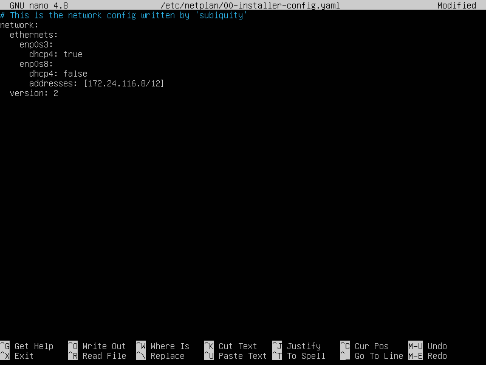
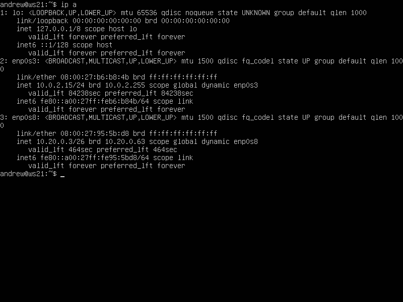
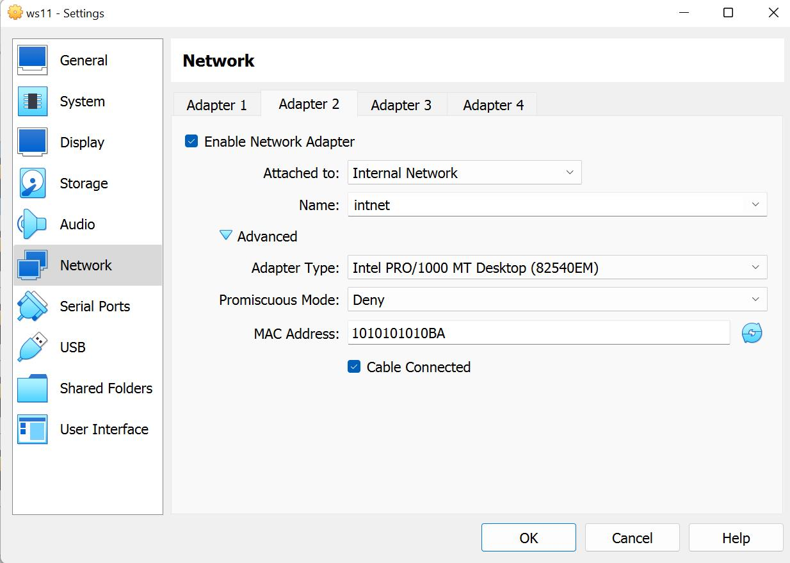
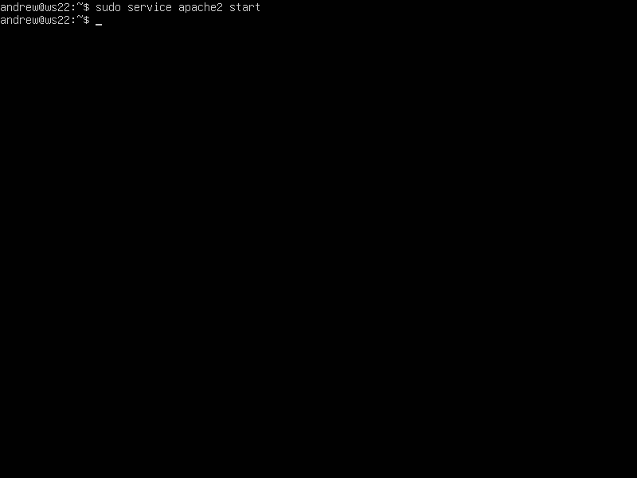

# Linux 02

## Part 1. Инструмент **ipcal**

---

### 1.1. Сети и маски

---

1) Адрес сети *192.167.38.54/13*


2)Перевод маски *255.255.255.0* в префиксную и двоичную запись, */15* в обычную и двоичную, *11111111.11111111.11111111.11110000* в обычную и префиксную


3) Минимальный и максимальный хост в сети *12.167.38.4* при масках: */8*, *11111111.11111111.00000000.00000000*, *255.255.254.0* и */4*

### 1.2 localhost

---

можно ли обратиться к приложению, работающему на localhost, со следующими IP:

1. *194.34.23.100 - нет*
2. *127.0.0.2 - да (имеется loopback)*
3. *127.1.0.1 - да (имеется loopback)*
4. *128.0.0.1 - нет*


### 1.3 Диапазоны и сегменты сетей

---


1) Какие IP можно использовать в качестве публичного, а какие только в качестве частных

1. *10.0.0.45 - частные*
2. *134.43.0.2 - публичный*
3. *192.168.4.2 - частные*
4. *172.20.250.4 - частный*
5. *172.0.2.1 - публичный*
6. *192.172.0.1 - публичный*
7. *172.68.0.2 - публичный*
8. *172.16.255.255 - частный*
9. *10.10.10.10 - частные*
10. *192.169.168.1 - публичные*

2) Какие из IP адресов шлюза возможны у сети *10.10.0.0/18*:

1. *10.0.0.1 - невозможен*
2. *10.10.0.2 - возможен*
3. *10.10.10.10 - возможен*
4. *10.10.100.1 - невозможен*
5. *10.10.1.255 - возможен*

## Part 2. Статическая маршрутизация между двумя машинами

---

Подними две виртуальные машины (далее -- ws1 и ws2).


С помощью команды ip a посмотри существующие сетевые интерфейсы.


- Опиши сетевой интерфейс, соответствующий внутренней сети, на обеих машинах и задать следующие адреса и маски: ws1 - *192.168.100.10*, маска */16*, ws2 - *172.24.116.8*, маска */12*.




С помощью команды `ip a` посмотри существующие сетевые интерфейсы.


### 2.1. Добавление статического маршрута вручную

---

**Добавляем статический маршрут от одной машины до другой командой**

---

**Команда ip r add используется для добавления пользовательских маршрутов в таблицу маршрутизации, позволяет вручную настроить, каким образом пакеты будут направляться к определенным сетям или хостам, после перезагрузки системы настройки удаляются.**

**Для sw1 введем команду**
**sudo ip r add 172.24.116.8 via 192.168.100.10 dev enp0s8**
**добавив статический маршрут до ws2**


- - -

**Для sw2 введем команду**
**sudo ip r add 192.168.100.10 via 172.24.116.8 dev enp0s8**
**добавив статический маршрут до ws1**


---

**Пропингуем соединение с помощью ping -c 5 на обеих машинах**


---

**Перезапустим машины sudo reboot**
### 2.2. Добавление статического маршрута с сохранением
**Добавляем статический маршрут с сохранением от одной машины до другой с помощью файла *etc/netplan/00-installer-config.yaml***


**После внесения изменений вызвана команда sudo netplan apply и пропинговано соединение между машинами.**

**Пропингуем соединение между машинами**


## Part 3. Утилита **iperf3**

---

### 3.1. Скорость соединения

Переведи и запиши в отчёт: 8 Mbps в MB/s, 100 MB/s в Kbps, 1 Gbps в Mbps.

Чтобы перевести скорость из мегабитов в секунду (Mbps) в мегабайты в секунду (MB/s), нужно разделить значение в мегабитах на 8, так как в 1 байте содержится 8 битов.

- 8 Mbps == 1MB/s (/8)
- 100 MB/s == 800 000Kbps 
переводим мегабайты в мегабиты → 100MB/s * 8 == 800Mbps 
переводим мегабиты в килобиты → 800Mbps * 1 000 = 800 000Kbps
- 1 Gbps == 1 000Mbps (*1000)

### 3.2. Утилита **iperf3**

Измерь скорость соединения между sw1 и sw2.

**Устанавливаем утилиту iperf3**
sudo apt install iperf3


ws1 выступает в роли сервера iperf3 -s


ws2 выступает в роли клиента iperf3 -c 192.168.100.10
Далее происходил обмен трафиком, и выведена средняя скорость передачи данных - 2.19Gbps


## Part 4. Сетевой экран

---

### 4.1. Утилита **iptables**

(Ссылки на материалы по iptables [тут](https://www.opennet.ru/man.shtml?topic=iptables&category=8&russian=0) и [тут](https://losst.pro/nastrojka-iptables-dlya-chajnikov))

**Создаем файл /etc/firewall.sh, имитирующий фаерволл, на sw1 и sw2**


- на sw1 написать сначала запрещающее, а потом разрешающее правило на пинг
    
Запрещающее правило:
    
    `iptables -A OUTPUT -p icmp --icmp-type echo-reply -j DROP`
    
Разрешающее правило:
    
    `iptables -A OUTPUT -p icmp --icmp-type echo-reply -j ACCEPT`
- Проверка, что правила добавлены (sudo iptables -L --line-numbers)

- Запустим ping c sw2, увидим, что sw1 перестала пинговаться

- Запустим ping c sw1 на sw2, увидим что пингуется

- обратную последовательность команд добавим для sw2 (в начале пишется разрешающее правило, а в конце пишется запрещающее правило)

    
    Разрешающее правило:
    
    `iptables -A OUTPUT -p icmp --icmp-type echo-reply -j ACCEPT`
    
    Запрещающее правило:
    
    `iptables -A OUTPUT -p icmp --icmp-type echo-reply -j DROP`


- откроем на машинах доступ для порта 22 (ssh) и порта 80 (http)
`iptables -t filter -A INPUT -p tcp --dport 22 -j ACCEPT`
    
    `iptables -t filter -A INPUT -p tcp --dport 80 -j ACCEPT`
Файлы /etc/firewall.sh


Запусти файлы на обеих машинах командами `chmod +x /etc/firewall.sh` и `/etc/firewall.sh`.
- sw1


- sw2


### 4.2. Утилита **nmap**

Устанавливаем утилиту `sudo apt install nmap` .
Пингуем sw2 - sw1, видим, что отклика нет, после вызываем `nmap 192.168.100.10` и видим, что хост машины запущен.

sw-2


Host is up

- **Сохранение дампов образов виртуальных машин**
    
    Дамп - состояние машины.
    
    Сохраняем текущее состояние в интерфейсе VirtualBox.


сохранение дампов образов виртуальных машин
## Part 5. Статическая маршрутизация сети

---

### 5.1. Настройка адресов машин

Настрой конфигурации машин в *etc/netplan/00-installer-config.yaml* согласно сети на рисунке.

Поднял пять виртуальных машин: 3 рабочие станции (ws11, ws21, ws22) и 2 роутера (r1, r2)

Подключал несколько адаптеров  (два - для рабочих станций, и три - для роутеров) при поднятии машин. У всех машин в первом адаптере выбран NAT (ему соответствует интерфейс enp0s3).

ВАЖНО! От каждого включенного адаптера создается один сетевой интерфейс. Они создаются по порядку: enp0s3 (от адаптера 1),  enp0s8 (от адаптера 2) и enp0s9 (от адаптера 3).

На картинке с заданием мы видим два интерфейса: eth0 и eth1. Им в нашем случае будут соответствовать интерфейсы enp0s8 (от адаптера 2) и enp0s9 (от адаптера 3).

!!!!! При поднятии машин обратить внимание, что у роутера r2 на картинке с заданием  интерфейс eth1 (то есть enp0s9) метчится с машинами ws21 и ws22 через интерфейс eth0 (то есть enp0s8) .
Поэтому, так как интерфейс enp0s9 соответствует адаптеру 3, а интерфейс enp0s8 соответствует адаптеру 2, то делаем вывод, что общая сеть для машин ws21, ws22 и r2 должна подключаться у r2 через адаптер 3, а у машин через адаптер 2.


5.1. Настройка адресов машин
- В отчёт помести скрины с содержанием файла *etc/netplan/00-installer-config.yaml* для каждой машины.

ws11


sws21


ws22


r1


r2


Сохраняем результат с помощью `sudo netplan apply`

Командой `ip a` проверяем, что адреса машин заданы верно

ws11


ws21


ws22


r1


r2


Пропингуем ws22 с ws21


Пропингуем r1 с ws11.


### 5.2. Включение переадресации IP-адресов

Для включения переадресации IP, выполни команду на роутерах:

`sudo sysctl -w net.ipv4.ip_forward=1`

r1


r2


В файл  */etc/sysctl.conf* и добавили в него строку
При выполнении вышеуказанной команды переадресация не будет работать после перезагрузки системы, поэтому в файле /etc/sysctl.conf  расскомментируем следующую строку - net.ipv4.ip_forward = 1

r1


r2


`net.ipv4.ip_forward = 1`*При использовании этого подхода, IP-переадресация включена на постоянной основе.*

### **5.3. Установка маршрута по-умолчанию**

Настроим маршрут по умолчанию (шлюз) для рабочих станций, для этого добавим default перед IP роутера в файле конфигураций

Пример вывода команды `ip r` после добавления шлюза:

```
default via 10.10.0.1 dev eth0
10.10.0.0/18 dev eth0 proto kernel scope link src 10.10.0.2

```

Настроили маршрут по-умолчанию (шлюз) для рабочих станций. Для этого добавили `default` перед IP роутера в файле конфигураций.

ws11


ws21


ws22


Проверка, что маршрут добавился в таблицу маршрутизации  ip r

ws11


ws21


ws22


Для того, чтобы пропинговать с ws11 роутер r2,  используем команду используем команду 
`tcpdump -tn -i enp0s9`


Запускаем tcpdump на r2, чтобы отслеживать трафик на машине
`tcpdump -tn -i enp0s9`


C ws11 начинаем пинговать r2  ping -c 5 10.100.0.12


На r2 видим, что запросы получены 

Роутер r2 получает запросы echo request , но ответ не отправляет, так как не прописан обратный адрес.
### 5.4. Добавление статических маршрутов

Добавили в роутеры r1 и r2 статические маршруты в файле конфигураций


для r1 шлюзом в сеть 10.20.0.0 будет 10.100.0.12


для r2 шлюзом в сеть 10.10.0.0 будет 10.100.0.11


С помощью ip r убедимся, что статический маршрут добавлен r1

С помощью ip r убедимся, что статический маршрут добавлен r2


**Запустить команды на ws11:**

Вызов команды `ip r list 10.10.0.0/18` выведет информацию о маршруте, связанном с конкретной подсетью.

Вызов команды `ip r list 0.0.0.0/0` используется для вывода информации о маршруте по умолчанию. Подсеть `0.0.0.0/0` представляет собой маршрут по умолчанию, который охватывает все возможные IP-адреса. Он указывает, как отправлять сетевой трафик, который не имеет явно заданного маршрута, или для которого не существует более конкретных маршрутов.

Для адреса 10.10.0.0/18 был выбран маршрут, отличный от 0.0.0.0/0, так как машина ws11 соединена с сетью 10.10.0.0/18 по своему IP-адресу 10.10.0.2, для других адресов используется маршрут по умолчанию, который указан в файле - 10.10.0.1.

Если указать адрес, то будет выбран прямой маршрут, в противном случает будет маршрут по умолчанию, т.е. до ближайшего узла.

### **5.5. Построение списка маршрутизаторов**
Запускаем на r1 команду дампа `tcpdump -tnv -i enp0s8`

Опции -tnv указывают `tcpdump` отобразить вывод в числовом формате, без разбора имен хостов и портов, и включить подробную информацию о пакетах.

запущена команда отслеживания сетевого трафика в реальном времени на r1

На ws11 запустили traceroute 10.20.0.10
Установка traceroute
sudo apt install traceroute

список маршрутизаторов на пути от ws11 до ws2


Принцип работы утилиты `traceroute` основан на отправке сетевых **пакетов с TTL** и анализе ответов от промежуточных узлов сети. 
**Пакет данных с TTL**  означает сетевой пакет, в котором задано значение TTL, которое определяет количество промежуточных узлов, через которые пакет может проходить, прежде чем быть отброшенным. TTL является частью заголовка IP-пакета и используется для предотвращения зацикливания или бесконечного циркулирования пакетов в сети.
Вот как происходит построение пути при помощи `traceroute`:

1. Когда запускается `traceroute` к какому-либо адресу (IP-адресу или доменному имени), он начинает отправлять пакеты данных с TTL (Time To Live), установленным на 1, к указанному адресу. 
2. Первый узел (роутер) в сети, через который проходит пакет, уменьшает значение TTL на 1. Если после уменьшения значение TTL становится равным 0, узел отбрасывает пакет и отправляет обратно сообщение "Time Exceeded" обратно отправителю.
3. Отправитель `traceroute` записывает информацию о первом узле, через который прошел пакет, а затем увеличивает значение TTL на 1 и отправляет следующий пакет.
4. Процесс повторяется: каждый промежуточный узел уменьшает TTL, и если TTL достигает 0, он отправляет обратно сообщение "Time Exceeded". Отправитель записывает информацию об этом узле и переходит к следующему шагу.
5. Когда пакет наконец достигает финального пункта назначения (конечного IP-адреса), пункт назначения отправляет ответ "ICMP Echo Reply" (если протокол ICMP используется для пакетов), который достигает отправителя `traceroute`.
6. `traceroute` завершает свою работу, предоставляя список всех узлов (роутеров), через которые проходили пакеты, и информацию о времени, которое требовалось для прохождения каждого узла.

Таким образом, `traceroute` позволяет отследить маршрут, который пакеты данных проходят от отправителя к получателю через сеть, а также измерить задержки (пинг) на каждом промежуточном узле.
### **5.6. Использование протокола ICMP при маршрутизации**
Запускаем на r1 перехват сетевого трафика tcpdump -n -i enp0s8

запущена команда отслеживания сетевого трафика в реальном времени на r1

Пингуем с ws11 несуществующий IP с помощью командыping -c 1 10.30.0.111

ping несуществующего адреса с ws11

Видим, что tcpdump отловил запрос 

tcpdump отловил запрос на r1

Сохраняем дампы образов виртуальных машин

дампы образов виртуальных машин после выполнения задания №5
### Part 6. Динамическая настройка IP с помощью DHCP 
- **Настроим на машине r2 службу DCHP**
    
    Для r2 настраиваем в файле /etc/dhcp/dhcpd.conf конфигурацию службы DHCP.
    
    Чтобы появился файл, который будем редактировать нужно установить пакет 
    `apt-get install isc-dhcp-server` .
    Утилита`isc-dhcp-server` позволяет настроить и управлять сервером DHCP, предоставляя IP-адреса и другие параметры клиентам.


В файле /etc/resolv.conf пропишем nameserver 8.8.8.8

     Файл resolv.conf содержит информацию о настройках DNS (Domain Name System) в операционной системе Linux. Он указывает системе, какие DNS-серверы использовать для разрешения доменных имен в IP-адреса.
     
     - Перезагружаем службу DHCP командой systemctl restart isc-dhcp-server  


- У машины ws21 в конфиге /etc/netplan/00-installer-config.yaml для интерфейса enp0s8 включаем dhcp4: true , чтобы интерфейс запрашивал сетевую конфигурацию у DHCP-сервера (машины r2), и комментируем заданные настройки IP адреса


После этого перезагружает машину ws21 через sudo reboot

IP адрес интерфейса enp0s8 до применения настроек dhcp4: true


IP адрес интерфейса enp0s8 после запроса конфигурации у DHCP-сервера (машины r2) на ws21



- Пингуем ws21 с ws22 


- Настроим на машине r1 службу DCHP с жесткой привязкой к MAC-адресу (ws11)
- **Что означает “жесткая привязка к MAC-адресу”**
    
    - это означает, что  DHCP-сервер назначает определенные IP-адреса и другие сетевые настройки для конкретных устройств (клиентов) в сети, исходя из их уникальных MAC-адресов.
    
    В обычной ситуации, DHCP-сервер назначает IP-адреса динамически клиентам в сети. Это означает, что каждый раз, когда устройство запрашивает сетевую конфигурацию у DHCP-сервера, сервер может назначить ему разный IP-адрес. Это удобно для многих устройств, но иногда бывает полезно иметь статический (постоянный) IP-адрес для определенных устройств.
    
    !!!! Настройка DHCP-сервера с жесткой привязкой к MAC-адресу гарантирует, что каждый раз, когда устройство запрашивает сетевую конфигурацию, DHCP-сервер всегда будет назначать ему один и тот же IP-адрес.
    
    Это особенно полезно, если у вас есть устройства, которым необходимо иметь постоянный IP-адрес для определенных сервисов или настроек в сети.

    - Указываем MAC адрес у ws11, для этого в etc/netplan/00-installer-config.yaml надо добавить строки: macaddress: 10:10:10:10:10:BA, dhcp4: true
 

- Важно выключить машину и в настройках сети поменять MAC-адрес на новый


MAC-адрес, сгенерированный автоматически


MAC-адрес заданный вручную

Настраиваем r1 аналогично r2:

- устанавливаем утилиту `apt-get install isc-dhcp-server` для того, чтобы r1 смог выполнять функцию DHCP-сервера
- настраиваем в файле /etc/dhcp/dhcpd.conf конфигурацию службы DHCP


в файле /etc/resolv.conf пропишем nameserver 8.8.8.8

перезагружаем службу DHCP командой systemctl restart isc-dhcp-server , на ws11 делаем sudo reboot

- Проверяем, что у интерфейса enp0s8  ws11 изменился MAC-адрес и IP адрес


- Пропингуем ws22 - ws21


- Запросим с ws21 обновление IP адреса
Сначала проверим текущий адрес


Чтобы обновить или освободить IP-адрес для конкретного интерфейса, в нашем случае для enp0s8, необходимо ввести 

`sudo dhclient -r enp0s8` и `sudo dhclient enp0s8`

Первая команда освободит текущий IP адрес, а вторая запросит новый


Сохраняем дампы образов виртуальных машин


### 7. NAT
**В данном задании используются виртуальные машины из Части 5 (используем дампы)!**

- Установим утилиту apache2 `sudo apt install apache2` на ws22 и r1.

- Установим утилиту apache2 `sudo apt install apache2` на ws22 и r1.
    - **Что такое Apache**
        
        Apache HTTP Server, также известный как Apache, является одним из самых популярных веб-серверов в мире. Он представляет собой программное обеспечение, которое обрабатывает входящие HTTP-запросы от клиентов (обычно веб-браузеров) и отвечает им, предоставляя веб-страницы, файлы, данные и другой контент.
        
        Применение веб-сервера Apache включает:
        
        1. **Сервер веб-сайтов:** Основное назначение Apache - это обслуживание веб-сайтов. Он может обрабатывать статические файлы (HTML, изображения, CSS, JavaScript) и динамически генерированный контент, такой как веб-страницы, создаваемые с использованием серверных языков программирования (например, PHP, Python, Ruby).
        2. **Виртуальные хосты:** Apache поддерживает настройку виртуальных хостов, что позволяет размещать несколько веб-сайтов на одном сервере с разными доменными именами или IP-адресами.
        3. **Прокси-сервер:** Apache может использоваться как прокси-сервер для пересылки запросов клиентов другим серверам, например, для балансировки нагрузки или для обеспечения дополнительных служб без прямого доступа клиентов к ним.
        4. **Обработка запросов:** Он поддерживает различные методы и модули для обработки и анализа входящих HTTP-запросов, что позволяет создавать сложные веб-приложения и API.
        5. **Защита и безопасность:** Apache предоставляет функциональности для настройки безопасности и защиты веб-приложений от атак, таких как инъекции и переполнения буфера.
        6. **Модульность:** Одной из сильных сторон Apache является его модульная архитектура. Это означает, что вы можете добавлять и настраивать различные модули в соответствии с вашими потребностями.
        7. **Отладка и анализ:** Apache предоставляет журналы доступа и журналы ошибок, которые помогают администраторам отслеживать и анализировать действия и проблемы на сервере.

В файле /etc/apache2/ports.conf на ws22 и r1 меняем строку Listen 80 
на Listen 0.0.0.0:80, то есть делаем сервер Apache2 общедоступным.


- Запускаем веб-сервер командой service apache2 start



- Создадим /etc/firewall.sh на r2
    - Добавим правила:
        
        1) удаление правил в таблице filter - `iptables -F`
        
        2) удаление правил в таблице "NAT" - `iptables -F -t nat`
        
        3) отбрасывать все маршрутизируемые пакеты - `iptables --policy FORWARD DROP`
- **Подробное описание команд**
    1. `iptables -F`: Эта команда очищает все правила (фильтров) в цепочках (chains) по умолчанию (INPUT, FORWARD, OUTPUT) и устанавливает политику ACCEPT для каждой цепочки. Это фактически отключает фильтрацию трафика, так как все пакеты будут разрешены.
    2. `iptables -F -t nat`: Эта команда аналогична предыдущей, но применяется к таблице NAT. Таблица NAT используется для изменения сетевых адресов и портов в пакетах. Очищение этой таблицы также отключит все правила в ней.
    3. `iptables --policy FORWARD DROP`: Эта команда устанавливает политику для цепочки FORWARD в таблице фильтрации (FILTER) на DROP. Это означает, что все пакеты, перенаправляемые через систему (например, маршрутизируемые между интерфейсами), будут отбрасываться по умолчанию. Это может использоваться для ужесточения безопасности и контроля над маршрутизацией. 

    

- Запустим /etc/firewall.sh: chmod +x /etc/firewall.sh и /etc/firewall.sh
  

  ping ws22 - r1 не проходит
  

- Добавим еще правила:
    
    4) разрешить маршрутизацию всех пакетов протокола ICMP
    
    `iptables -A FORWARD -p icmp -j ACCEPT`
      

      После добавления команды ws22 пингуется с r1
    
ping ws22 - r1: после разрешения маршрутизации всех пакетов ICMP - проходит

5) включить SNAT, а именно маскирование всех локальных ip из локальной сети, находящейся за r2 (сеть 10.20.0.0)

- **Что такое SNAT**
    
    SNAT (Source Network Address Translation) - это метод трансляции адресов сети, используемый, чтобы изменить исходный IP-адрес пакета в сети.
    
    Процесс SNAT осуществляется на маршрутизаторах, брандмауэрах или других устройствах сетевого уровня и позволяет управлять тем, как исходящий трафик будет выглядеть на удаленной стороне.

    5.1) Разрешаем маршрутизацию всех TCP-пакетов на 80 порт

`iptables -A FORWARD -p tcp --dport 80 ACCEPT`

5.2)  Разрешаем маршрутизацию для пакетов с уже установленным соединением 

**Внешние пакеты с установленным соединением** (External Packets with Established Connection) относятся к пакетам данных, которые связаны с уже установленным сетевым соединением. В контексте маршрутизации и сетевых правил, такие пакеты имеют особый статус и обрабатываются иначе, чем новые или исходящие пакеты.

`iptables -A FORWARD -p tcp -m state --state ESTABLISHED -j ACCEPT`    

5.3) Изменим исходящий IP адрес для пакетов из сети 10.20.0.0/26

`iptables -t nat -A POSTROUTING -s 10.20.0.0/26 -o enp0s8 -j SNAT --to-source 10.100.10.12`

- **Расшифровка команды**
    
    Эта команда применяется к таблице NAT (`-t nat`) и цепочке POSTROUTING (`-A POSTROUTING`), чтобы выполнить Source Network Address Translation (SNAT) для исходящего трафика, исходящего из сети `10.20.0.0/26` через интерфейс `enp0s8`.
    
    Разберем параметры этой команды:
    
    - `s 10.20.0.0/26`: Этот параметр указывает на исходный IP-адрес отправителя (source), который находится в диапазоне `10.20.0.0` до `10.20.0.63` (маска подсети `/26`).
    - `o enp0s8`: Этот параметр указывает на сетевой интерфейс, через который пакеты будут исходить. В данном случае, это `enp0s8`.
    - `j SNAT --to-source 10.100.10.12`: Этот параметр `j` определяет действие, которое будет выполнено с пакетами, соответствующими этому правилу. В данном случае, действием является SNAT (Source Network Address Translation), то есть перевод исходного адреса отправителя пакетов. Опция `--to-source` указывает, на какой IP-адрес (в данном случае `10.100.10.12`) нужно заменить исходный IP-адрес отправителя.
    
    В итоге, данное правило изменяет исходный IP-адрес отправителя для исходящих пакетов, исходящих из сети `10.20.0.0/26`, через интерфейс `enp0s8` на IP-адрес `10.100.10.12`. Это может быть полезным, например, при настройке маршрутизации для перевода исходных адресов из конкретной подсети.

    6) включить DNAT на 8080 порт машины r2 и добавить к веб-серверу Apache, запущенному на ws22, доступ извне сети

    - **Что такое DNAT**
    
    DNAT (Destination Network Address Translation) - это метод, который изменяет IP-адрес назначения (destination address) пакетов, проходящих через маршрутизатор или брандмауэр.
    
    Когда пакеты приходят на внешний интерфейс маршрутизатора или брандмауэра, DNAT перенаправляет их на другой внутренний IP-адрес, который может быть размещен внутри локальной сети. 
    

`iptables -t nat -A PREROUTING -i enp0s8 -p tcp --dport 8080 -j DNAT --to-destination 10.20.0.20:80`


итоговый файл firewall.sh на r2

- Проверим соединение по TCP для SNAT, предварительно отключив в конфиге ws22 интерфейс NAT (и сохранив изминения `sudo netpla apply`)


- Командой telnet 10.10.0.1 80 тестируем соединение ws22 с r1
